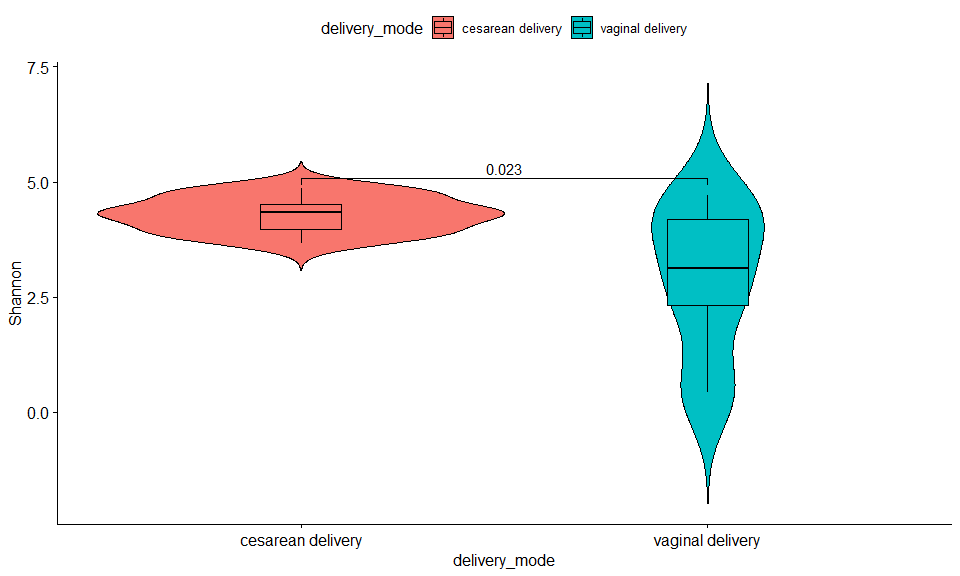
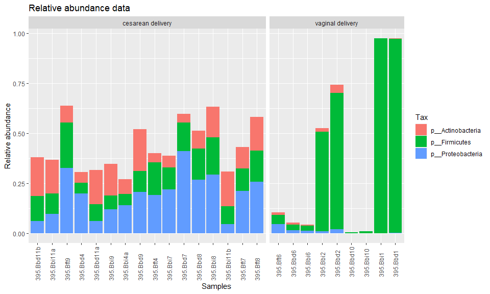
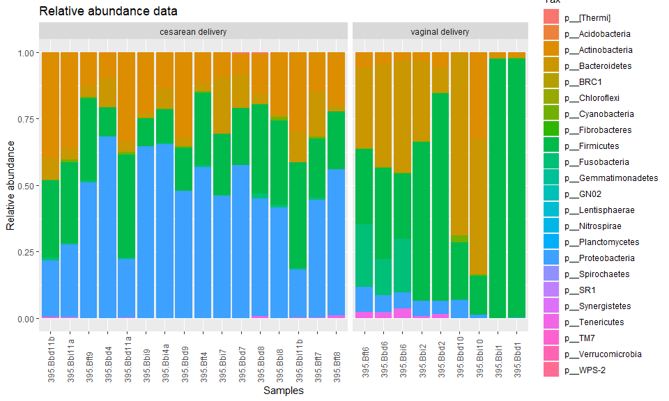
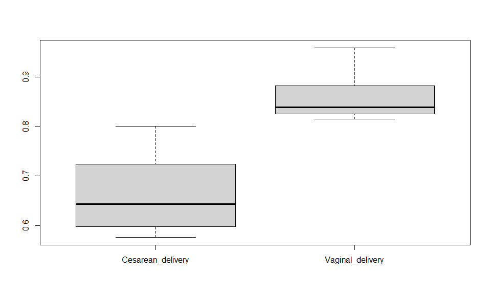
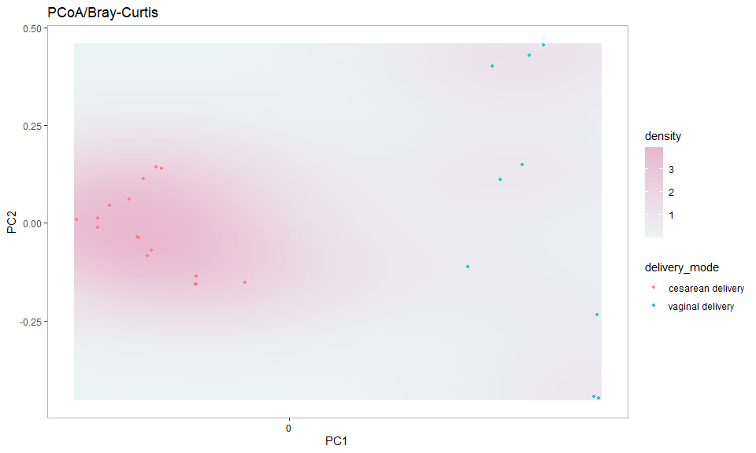

Metataxonomics\_project\_for\_Computational\_Genomics
================
Aaron Mohammed
4/29/2022

``` r

####Alpha diversity analysis####
#Calculate Shannon diversity for the samples
tab<-microbiome::diversity(pseq,index="all")
kable(tab)
```

|            | inverse\_simpson | gini\_simpson |   shannon |     fisher | coverage |
| :--------- | ---------------: | ------------: | --------: | ---------: | -------: |
| 395.Bbd11b |        50.474941 |     0.9801882 | 4.8063404 | 112.580917 |       25 |
| 395.Bbi11a |        52.850896 |     0.9810788 | 4.8526899 | 128.252799 |       24 |
| 395.Bft9   |        18.497685 |     0.9459392 | 3.7996859 |  28.465303 |       10 |
| 395.Bbd4   |        34.193948 |     0.9707551 | 4.3868516 |  78.824193 |       13 |
| 395.Bbd11a |        43.091958 |     0.9767938 | 4.7687219 | 129.581276 |       20 |
| 395.Bbi9   |        19.732400 |     0.9493219 | 3.9982071 |  60.121479 |        9 |
| 395.Bft6   |        24.655221 |     0.9594406 | 4.3744534 |  95.506269 |       13 |
| 395.Bbi4a  |        55.094509 |     0.9818494 | 4.7540126 |  95.540478 |       24 |
| 395.Bbd9   |        24.234484 |     0.9587365 | 4.1379489 |  43.089824 |       13 |
| 395.Bft4   |        40.502679 |     0.9753103 | 4.4105520 |  50.140393 |       18 |
| 395.Bbi7   |        26.802346 |     0.9626898 | 4.2285275 |  54.148650 |       13 |
| 395.Bbd6   |        41.110143 |     0.9756751 | 4.7187042 | 122.543851 |       21 |
| 395.Bbi6   |        23.150281 |     0.9568040 | 4.1775887 |  83.716825 |       10 |
| 395.Bbi2   |         5.471942 |     0.8172495 | 3.1257745 |  50.287681 |        3 |
| 395.Bbd7   |        25.817563 |     0.9612667 | 3.8776971 |  29.546053 |        9 |
| 395.Bbd2   |         2.904138 |     0.6556637 | 2.3185348 |  33.922381 |        1 |
| 395.Bbd10  |        22.784937 |     0.9561114 | 4.0000225 |  73.582907 |        8 |
| 395.Bbi10  |         5.767372 |     0.8266108 | 2.5594152 |  31.784196 |        2 |
| 395.Bbd8   |        31.989531 |     0.9687398 | 4.3606157 |  51.780568 |       16 |
| 395.Bbi8   |        22.149961 |     0.9548532 | 3.9124695 |  30.779254 |       10 |
| 395.Bbi11b |        36.041806 |     0.9722544 | 4.4415767 |  95.425889 |       14 |
| 395.Bft7   |        35.598139 |     0.9719086 | 4.3077430 |  49.099226 |       13 |
| 395.Bft8   |        20.959705 |     0.9522894 | 3.6609883 |  20.685511 |        9 |
| 395.Bbi1   |         1.219784 |     0.1801824 | 0.4268256 |   2.054153 |        1 |
| 395.Bbd1   |         1.223449 |     0.1826388 | 0.4595187 |   3.834272 |        1 |

``` r

df_meta<-microbiome::meta(pseq)

df_meta$Shannon<-tab$shannon
df_meta$Fisher<-tab$fisher
df_meta$Inverse_simpson<-tab$inverse_simpson
df_meta$Gini_simpson<-tab$gini_simpson

# Violin plot comparing Shannon diversity based on delivery_mode
plot_div<-ggviolin(df_meta,x="delivery_mode",y="Shannon", add="boxplot",fill="delivery_mode")
plot_div<-plot_div+stat_compare_means(comparisons = list(c("cesarean delivery","vaginal delivery")),
                          method="wilcox.test")

print(plot_div)
```

<!-- -->

``` r
#save plot
pdf("C:/Users/amoha/Downloads/Metataxonomics_project/Analysis/Rfigs/violin_alpha_diversity.pdf",width = 10,height = 9)
ggarrange(plot_div,nrow = 1,ncol = 1)
dev.off()
## png 
##   2
```

``` r
####Composition plot#####

# Relative level for each taxa

pseq.rel<-microbiome::transform(pseq,"compositional")

# Remove rare OTUs
pseq.rel.core<-core(pseq.rel,detection = 0,prevalence = 0.5)

# Aggregate to the phylum level

pseq.rel.core.phylum<-aggregate_taxa(pseq.rel.core,level="Phylum")

# Plot composition of each delivery_mode

comp_plot<-plot_composition(pseq.rel.core.phylum,group_by="delivery_mode")+
  guides(fill=guide_legend(ncol=1))+
    labs(x = "Samples", y = "Relative abundance",
     title = "Relative abundance data")
print(comp_plot)
```

<!-- -->

``` r

# Aggregate to the phylum level

pseq.rel.phylum<-aggregate_taxa(pseq.rel,level="Phylum")

# Plot composition of each delivery_mode

comp_plot2<-plot_composition(pseq.rel.phylum,group_by="delivery_mode")+
  guides(fill=guide_legend(ncol=1))+
    labs(x = "Samples", y = "Relative abundance",
     title = "Relative abundance data")
print(comp_plot2)
```

<!-- -->

``` r
#save plot
pdf("C:/Users/amoha/Downloads/Metataxonomics_project/Analysis/Rfigs/composition_rare_removed.pdf",width = 10,height = 7)
comp_plot
dev.off()
## png 
##   2

pdf("C:/Users/amoha/Downloads/Metataxonomics_project/Analysis/Rfigs/composition_overall.pdf",width = 10,height = 7)
comp_plot2
dev.off()
## png 
##   2
```

``` r

####Beta diversity analysis####

# Rarefy

pseq.rarefied<-rarefy_even_depth(pseq,rngseed=8675309,replace=F)
## `set.seed(8675309)` was used to initialize repeatable random subsampling.
## Please record this for your records so others can reproduce.
## Try `set.seed(8675309); .Random.seed` for the full vector
## ...
## 1786OTUs were removed because they are no longer 
## present in any sample after random subsampling
## ...

##Calculate the references for each group
cesarean_ref<-apply(abundances(subset_samples(pseq.rarefied,delivery_mode=="cesarean delivery")),1,median)
vaginal_ref<-apply(abundances(subset_samples(pseq.rarefied,delivery_mode=="vaginal delivery")),1,median)

b.cesarean<-divergence(x=subset_samples(pseq.rarefied,delivery_mode=="cesarean delivery"),y=cesarean_ref,method="bray")
b.vaginal<-divergence(x=subset_samples(pseq.rarefied,delivery_mode=="vaginal delivery"),y=vaginal_ref,method="bray")

boxplot(list(Cesarean_delivery=b.cesarean,Vaginal_delivery=b.vaginal))
```

<!-- -->

``` r
wilcox.test(x=b.cesarean,y=b.vaginal,alternative = "less")
## 
##  Wilcoxon rank sum exact test
## 
## data:  b.cesarean and b.vaginal
## W = 0, p-value = 4.895e-07
## alternative hypothesis: true location shift is less than 0
```

``` r

#####Sample ordination####

sample_data(pseq.rarefied)$delivery_mode<-as.factor(sample_data(pseq.rarefied)$delivery_mode)
sample_data(pseq.rarefied)$delivery_mode<-relevel(sample_data(pseq.rarefied)$delivery_mode,ref="cesarean delivery")

# PCoA plot
 ord_plot<-plot_landscape(pseq.rarefied,method="PCoA",distance = "bray",col="delivery_mode")+labs(title="PCoA/Bray-Curtis")
 print(ord_plot)
```

<!-- -->

``` r
 
# Check for equal variances between groups 
 dist<-vegdist(t(otu_table(pseq.rarefied)),method="bray")
 
 print(anova(betadisper(dist,microbiome::meta(pseq.rarefied)$delivery_mode)))
## Analysis of Variance Table
## 
## Response: Distances
##           Df   Sum Sq   Mean Sq F value  Pr(>F)  
## Groups     1 0.018277 0.0182766  5.7894 0.02456 *
## Residuals 23 0.072609 0.0031569                  
## ---
## Signif. codes:  0 '***' 0.001 '**' 0.01 '*' 0.05 '.' 0.1 ' ' 1
 
# Permonva based on delivery_mode
 
permonva_results<-adonis(t(otu_table(pseq.rarefied))~delivery_mode,data=microbiome::meta(pseq.rarefied),
                 permutations = 100,method="bray")
print(permonva_results)
## 
## Call:
## adonis(formula = t(otu_table(pseq.rarefied)) ~ delivery_mode,      data = microbiome::meta(pseq.rarefied), permutations = 100,      method = "bray") 
## 
## Permutation: free
## Number of permutations: 100
## 
## Terms added sequentially (first to last)
## 
##               Df SumsOfSqs MeanSqs F.Model      R2   Pr(>F)   
## delivery_mode  1    1.9366 1.93656  6.3637 0.21672 0.009901 **
## Residuals     23    6.9992 0.30431         0.78328            
## Total         24    8.9357                 1.00000            
## ---
## Signif. codes:  0 '***' 0.001 '**' 0.01 '*' 0.05 '.' 0.1 ' ' 1

permonva_result_coefs<-coefficients(permonva_results)
permonva_result_delivery_mode<-permonva_result_coefs["delivery_mode1",]
```

``` r
pdf("C:/Users/amoha/Downloads/Metataxonomics_project/Analysis/Rfigs/pcao_plot.pdf",width = 8, height = 6)
ord_plot
dev.off()
## png 
##   2
```

``` r
####glm and manhattan plot####

##Remove rare OTUs
pseq.core<-core(pseq,detection = 0,prevalence = 0.2)
# otu_table(pseq)
count<-otu_table(pseq.core)@.Data
# count<-apply(count,2,as.numeric)
View(tax_table(pseq)@.Data)
View(microbiome::meta(pseq))

#set group data
group<-factor(meta(pseq)[,10])

#set compare matrix
design<-model.matrix(~ 0 + group)

#estimate dispersion
y<-estimateDisp(count, design)
#fit glm model
result<-glmFit(count,design=design,dispersion = y$trended.dispersion,prior.count=0.125)
#extract coefficients and p-values
summary<-glmLRT(result,coef=c(1:ncol(result$design)))
#p-value table
p_df<-summary$table
#use fdr method to adjusted p-value
p_df$Pvalue_adj<-p.adjust(p_df$PValue,method = "fdr")

#build plot matrix
tax_df<-tax_table(pseq)@.Data
plot_matrix<-merge(tax_df,p_df,by="row.names")

#Manhattan plot
plot_matrix<-plot_matrix[order(plot_matrix$Phylum),]
plot_matrix$x<-c(1:nrow(plot_matrix))
plot_matrix$is.annotate<-ifelse(plot_matrix$Pvalue_adj<5e-15,1,0)
dim(plot_matrix)
## [1] 187  16
table(plot_matrix$is.annotate)
## 
##   0   1 
## 160  27


ylim <- plot_matrix %>% 
  filter(Pvalue_adj == min(Pvalue_adj)) %>% 
  mutate(ylim = abs(floor(log10(Pvalue_adj))) + 2) %>% 
  pull(ylim)

options(ggrepel.max.overlaps = Inf)

manhplot <- ggplot(plot_matrix, aes(x = x, y = -log10(Pvalue_adj), 
                                  color = as_factor(Phylum), size = -log10(Pvalue_adj))) +
  geom_hline(yintercept = -log10(5e-8), color = "grey40", linetype = "dashed") + 
  geom_hline(yintercept = -log10(5e-10), color = "Salmon", linetype = "dashed") + 
  geom_point( size = 3) +
  # scale_x_continuous(label = axis_set$chr, breaks = axis_set$center) +
  scale_y_continuous(expand = c(0,0), limits = c(4, ylim)) +
  scale_size_continuous(range = c(0.5,3)) +
  #change color 
  scale_color_manual(name='Phylum',values = brewer.pal(6, "Dark2"))+
  #add legend
  guides(color= guide_legend(keywidth = 0.8, keyheight = 0.8))+
  #annotate significant genus
  geom_label_repel( data=subset(plot_matrix, is.annotate==1), aes(label=Genus), size=4) +
  labs(x = NULL, 
       y = "-log<sub>10</sub>(p)") + 
  theme( 
    panel.grid.major.x = element_blank(),
    panel.grid.minor.x = element_blank(),
    axis.title.y = element_markdown(),
    axis.title.x=element_blank(),
          axis.text.x=element_blank(),
          axis.ticks.x=element_blank())
  # theme(plot.margin = unit(c(2,3,2,2), "cm"))
manhplot
```

<!-- -->

``` r
##save plot
pdf("C:/Users/amoha/Downloads/Metataxonomics_project/Analysis/Rfigs/manhattan_overall.pdf",width=12,height = 8)
manhplot
dev.off()
## png 
##   2
```
